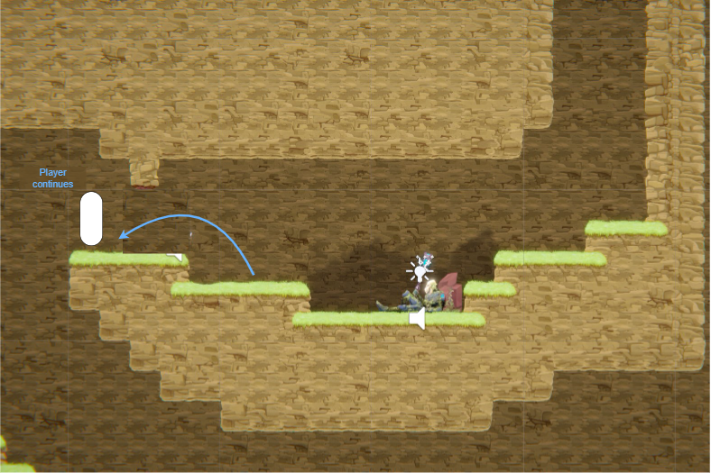
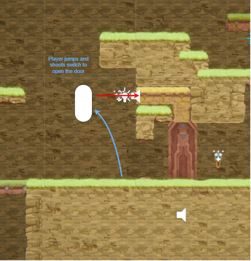

# COMP2150  - Level Design Document
### Name: Samuel Turnill
### Student number: 47582383

<!-- Here goes nothing, let's hope there aren't any spelling mistakes -->
<!-- Oh the commit message has to be "Final Submission" not "Final Commit"-->

## 1. Player Experience (~700 words)
<!-- Outline and justify how your level design facilitates the core player experience goals outlined in the assignment spec. Each section should be supported by specific examples and screenshots of your game encounters that highlight design choices made to facilitate that particular experience. -->

### 1.1. Discovery
<!-- What does the player learn? How does your encounter and broader level design facilitate learning in a way that follows good design practice? -->
The player learns the mechanics of different objects in the first section, and then more advanced uses and interactions between the objects in sections two and three. My design facilitates learning in a way that follows good design practice but never overwhelming the player, and introducing mechanics cleverly. Most mechanics are introducted one at a time in their own encounters, but some are introduced together to better teach important information, but all mechanics are introduced in a safe environment.

### 1.2. Drama
<!-- What is the intensity curve? How does your design facilitate increasing yet modulating intensity, with moments of tension and relief?  -->
The intensity curve of my design increases as the player moves through the level, with peaks and troughs to provide some variety and keep the player in the flow. My design has increasing yet modulating intensity by increasing the challenge of each encounter as the level progresses. Moments of tension anre relief are also created by keeping challenges separated by more low-intensity encounters, and giving the player opportunities to explore.

### 1.3. Challenge
<!-- What are the main challenges? How have you designed and balanced these challenges to control the difficulty curve and keep the player in the flow channel? -->
The main challenges in my design are the nuanced control of the character and the weapons during platforming encounters. I have designed and balanced these challenges to control the difficulty curve and keep the player in the flow channel by increasing the challenge as they progress, with later encounters being more complex and having more mechanics used in more complex ways.

### 1.4. Exploration
<!-- How does your level design facilitate autonomy and invite the player to explore? How do your aesthetic and layout choices create distinct and memorable spaces and/or places? -->
My level design facilitates autonomy and invites the player to explore but not being entirely linear, as well as providing rewards to players who explore. Section 1 has a hub area which connects to two other smaller areas, which introduce a few mechanics each, and the player can choose either section to play through first. Section 2 and 3 are also connected by a hub area, and allow the player to choose which one to play first. Various encounters also have a second, more difficult path to take, which rewards the player with a health pickup. My aesthetic and layout choices create distinct and memorable spaces and places by using unique design language. Section 2 and 3 have their own theme, style, and main mechanics. The hub areas offer a place to rest and are revisited, making them more memorable.

## 2. Core Gameplay (~400 words)
<!-- A section on Core Gameplay, where storyboards are used to outline how you introduce the player to each of the required gameplay elements in the first section of the game. Storyboards should follow the format provided in lectures. -->

<!-- Storyboards can be combined when multiple mechanics are introduced within a single encounter. Each section should include a sentence or two to briefly justify why you chose to introduce the mechanic/s to the player in that sequence.

You should restructure the headings below to match the order they appear in your level. -->

### 2.1. Spikes

Spikes are introduced first, as they don't move and are therefore a small step up from regular platforming.

### 2.2. Passthrough Platforms & Health Pickups

As the spikes are unavoidable, the player will always collect the health pickup and learn what it does. This avoids the potential problem of a player not having taken damage before reaching a health pickup.
Passthrough Platforms and Health Pickups are introduced next, as the passthrough platform is a simple addition to basic platforming, and the health pickup is an important item.

### 2.3. Acid & Checkpoints

Acid provides another step up from basic platforming, so it was introduced next. Due to how the acid immediately kills the player, checkpoints were also introducted here so the player would learn how they work and not have to play the earlier stages of the level if they touch the acid.

### 2.4. Moving Platforms

Moving platforms provide some variety to basic platforming, and provides a safe interlude after the acid, so they are introduced here.

### 2.5. Weapon Pickup (Staff), Spitters, & Destructable Columns

The Staff, Spitters, and Destructable Columns were all introduced in a small encounter in order to teach the player how they all work with a simple demonstration. The Spitter and Column are placed very close to one another so that when the player swipes at the Spitter with the Staff, the Spitter is killed, but the Column is also destroyed.

### 2.6. Weapon Pickup (Gun) & Chompers

The Gun and Chompers are introduced together to show the player the second part of the combat mechanics.

### 2.7. Single Use Switch & Trigger Door

The Switch and Trigger Door are introduced together to demonstrate how they cannot function independently, a switch will always be connected to a door. Different coloured tiles help to visually "connect" the two together so the player always knows where a switch for a door is or vice versa. The Switch is embedded in the ground so the player cannot try to activate it with their body, and must instead shoot it with the gun, opening the door.

### 2.8. Keys

Keys are the final mechanic introduced, due to being a reward for the player for completing the first section, and a mental separator to separate the first section from the second section. The player must shoot the Switch with the gun and break the Column with the Staff to reinforce understanding of those mechanics.

## 3. Spatiotemporal Design
<!-- A section on Spatiotemporal Design, which includes your molecule diagram and annotated level maps (one for each main section of your level). These diagrams may be made digitally or by hand, but must not be created from screenshots of your game. The annotated level maps should show the structure you intend to build, included game elements, and the path the player is expected to take through the level. Examples of these diagrams are included in the level design lectures.

No additional words are necessary for this section (any words should only be within your images/diagrams). -->
 
### 3.1. Molecule Diagram

<!-- didn't make maps that aren't screenshots oops :(
### 3.2. Level Map – Section 1

### 3.3. Level Map – Section 2

### 3.4. Level Map – Section 3 -->

## 4. Iterative Design (~400 words)
<!-- Reflect on how iterative design helped to improve your level. Additional prototypes and design artefacts should be included to demonstrate that you followed an iterative design process (e.g. pictures of paper prototypes, early grey-boxed maps, additional storyboards of later gameplay sequences, etc.). You can also use this section to justify design changes made in Unity after you drew your level design maps shown in section 3. 

You should conclude by highlighting a specific example of an encounter, or another aspect of your level design, that could be improved through further iterative design. -->
I struggled with following the intended design process that goes from storyboarding through diagrams and then to greyboxing, as I feel that I am not good at coming up with ideas without actively interacting with the prefabs tools in Unity. I found it much easier to go straight into Unity and experiment with the prefabs to get ideas which I fleshed out further in some diagrams. I still iterated on the design plenty, and some diagrams were helpful in organising my ideas, but overall I am unhappy with how little I managed to use those tools. Despite this, I still believe I iterated effectively.

All of the assets were provided to us already, so I found that editing with the tilemap in Unity faster and more efficient than greyboxing in an external tool. The Unity tilemap editor provided all the tools required to effectively iterate and modify designs.

My design process was as follows:
1. Experiment with the prefabs to learn how they work and understand the different interactions that are possible between them
2. Mock up some encounters to get an idea of what I want the level to be and what mechanics I want to focus on
3. Create a flowchart for the dramatic pacing and intensity curve of the level (below is my original plan, which changed a little throughout development)

4. Create a molecule diagram diagram for the initial introductory encounters
5. Create a more high-level molecule diagram for groups of encounters, and how each section connects (below is an image from earlier in development)

6. Create the first section in Unity to introduce all the mechanics I wanted to use
7. Create a lot of individual, separated encounters in Unity based on certain mechanics and prefabs for the second and third sections
8. Connect each encounter together in Unity in a way that follows dramatic pacing
I iterated on the encounter designs by constantly testing every change made in Unity, ensuring that players for example, could make jumps or that they had enough space for more difficult platforming maneuvers. Each change was tested to ensure it provided the desired player experience also. It is for this reason that I believe I still iterated effectively, albeit without using the diagramming tools.

The section after getting the third key (pictured below, circled in red) could definitely be improved with more iteration. Not wanting to introduce any more mechanics, I had difficulty continuing the dramatic pacing in a satisfying manner.

This problem could possibly have been solved by shifting around other sections of the level to shorten the space required, but Unity becomes really slow when lots of prefabs are in the scene. Further iteration would help improve this section.

## Generative AI Use Acknowledgement

No generative AI was used in this project.
<!-- 
Use the below table to indicate any Generative AI or writing assistance tools used in creating your document. Please be honest and thorough in your reporting, as this will allow us to give you the marks you have earnt. Place any drafts or other evidence inside this repository. This form and related evidence do not count to your word count.
An example has been included. Please replace this with any actual tools, and add more as necessary. -->

